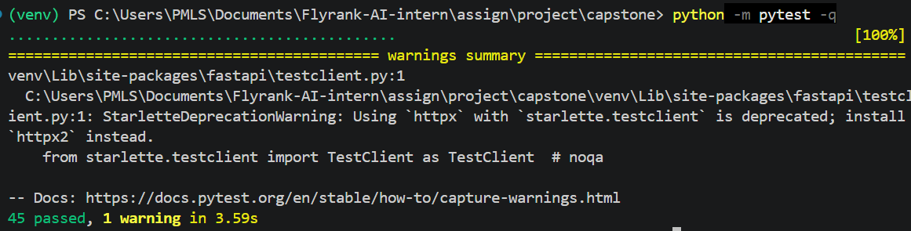
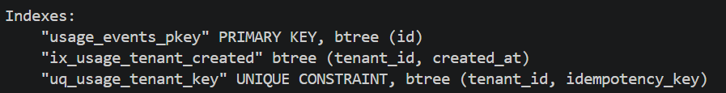
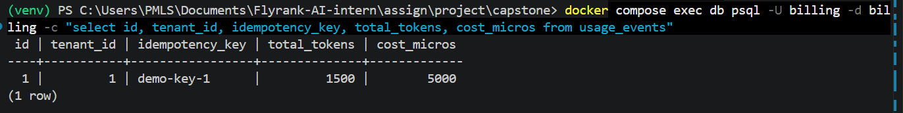
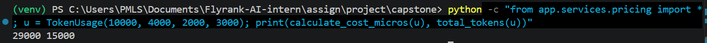
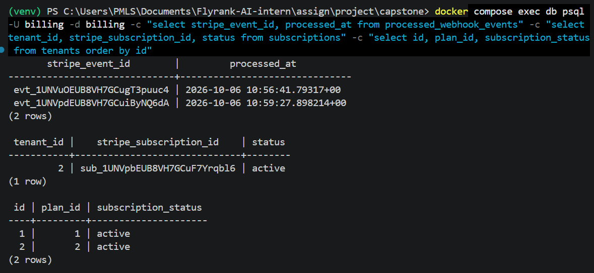
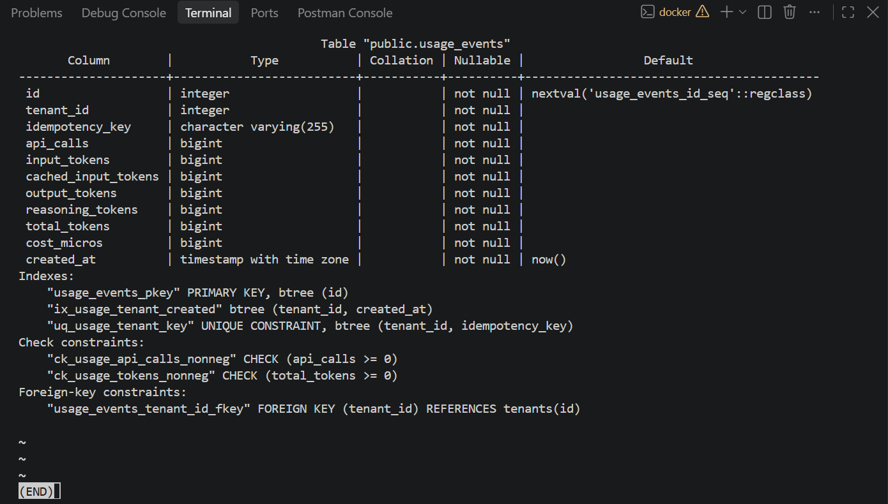
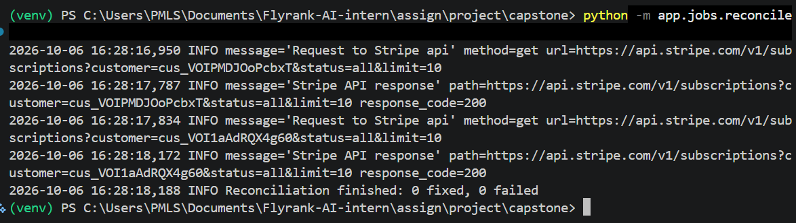

# Evidence

One proof per requirement from Section 6 of the brief. Everything automated can be
reproduced with `python -m pytest -v`. Screenshots are in `evidence/`, and the key text is
copied here so each proof reads without opening an image. The complete test output is in
[`evidence/pytest_full_output.txt`](evidence/pytest_full_output.txt).

## Full suite

`python -m pytest -q` → **45 passed**



---

## Metering

**A billable action creates exactly one usage event, even under retries.**

Tests in `tests/test_metering.py` (all PASSED, see [proof-1](evidence/proof-1.png) and
[proof-2](evidence/proof-2.png)):

- `test_same_key_twice_creates_one_event`: sends the same request twice. Asserts the second
  response body equals the first, carries `Idempotent-Replayed: true`, and that
  `usage_events` holds exactly one row.
- `test_same_key_different_body_is_rejected`: same key with a different body returns 409.
- `test_tenants_can_use_the_same_key`: the key is unique per tenant, not global.

The guarantee sits in the database, not in application code. `usage_events` has a unique
constraint on `(tenant_id, idempotency_key)`:

```
Indexes:
    "usage_events_pkey" PRIMARY KEY, btree (id)
    "ix_usage_tenant_created" btree (tenant_id, created_at)
    "uq_usage_tenant_key" UNIQUE CONSTRAINT, btree (tenant_id, idempotency_key)
```



A request sent twice with the key `demo-key-1` left a single row (5000 micros, 1500 tokens):

```
 id | tenant_id | idempotency_key | total_tokens | cost_micros
----+-----------+-----------------+--------------+-------------
  1 |         1 | demo-key-1      |         1500 |        5000
(1 row)
```



A live call through the HTTP API: [first call, 200 OK](evidence/probe1.png).

---

## Quotas

**Usage is checked against the plan; requests over the limit are rejected.**

Boundary rule: a request is allowed when `used + requested <= limit`. Tenant 2 (Free plan,
limit 100,000 tokens) was driven to its exact limit:

| Request | Tokens | Running total | Result |
|---|---|---|---|
| boundary-a | 99,999 | 99,999 | 200 OK ([screenshot](evidence/probe2_1.png)) |
| boundary-b | 1 | 100,000 (exactly the limit) | 200 OK ([screenshot](evidence/probe2_2.png)) |
| boundary-c | 1 | would be 100,001 | **402** ([screenshot](evidence/probe2_3.png)) |

Tests: `test_token_boundary_exact_limit_allowed_then_blocked`,
`test_api_call_boundary_exact_limit_allowed_then_blocked` (999 → 1,000 allowed, next blocked),
`test_blocked_request_records_nothing` (a rejected request is never billed),
`test_retry_of_successful_request_at_limit_is_not_blocked` (a retry of a request that
already succeeded gets its original answer, even at the limit).

**Responses carry the correct status codes and a message explaining why.**

```
HTTP/1.1 402 Payment Required
{"error":"upgrade_required","message":"Monthly AI tokens quota exceeded: used 100000 + requested 1 exceeds the free plan limit of 100000. Upgrade to Pro for higher limits."}
```

| Situation | Status | Test |
|---|---|---|
| Free plan over limit | 402 | `test_token_boundary_exact_limit_allowed_then_blocked` |
| Pro plan over limit | 429 + `Retry-After` | `test_pro_plan_over_limit_returns_429_with_retry_after` |
| Subscription `past_due` | 402 | `test_past_due_subscription_returns_402` |

The 429 path is proven by test only. Reaching 5,000,000 tokens by hand isn't practical, so
the test inserts usage directly.

---

## Cost calculation

**Pricing constants are pinned in config** (`app/pricing_config.py`), as integer
micro-dollars (1 USD = 1,000,000):

```python
INPUT_PRICE_PER_MTOK = 1_000_000          # $1.00 per 1M fresh input tokens
CACHED_INPUT_PRICE_PER_MTOK = 250_000     # $0.25 per 1M cached input tokens
OUTPUT_PRICE_PER_MTOK = 4_000_000         # $4.00 per 1M output tokens (reasoning billed the same)
API_CALL_PRICE_MICROS = 2_000             # $0.002 per API call
```

**Token pricing handles cached input, reasoning tokens and output correctly.**

Worked example (hand-calculated, then checked against the code): input 10,000 of which
4,000 are cached, output 2,000, reasoning 3,000, one API call.

| Part | Tokens | Price per 1M | Cost (micros) |
|---|---|---|---|
| Fresh input (10,000 − 4,000) | 6,000 | $1.00 | 6,000 |
| Cached input | 4,000 | $0.25 | 1,000 |
| Output (2,000 + 3,000 reasoning) | 5,000 | $4.00 | 20,000 |
| API call | 1 | | 2,000 |
| **Total** | | | **29,000** |

Quota tokens = 10,000 + 2,000 + 3,000 = **15,000**. Adding all four columns would wrongly
give 19,000, because cached tokens are already inside `input_tokens`.

```
> python -c "from app.services.pricing import *; u = TokenUsage(10000, 4000, 2000, 3000); print(calculate_cost_micros(u), total_tokens(u))"
29000 15000
```



`tests/test_pricing.py` (11 tests, all PASSED, [screenshot](evidence/proof-2.png)):
`test_worked_example_total_cost`, `test_quota_tokens_do_not_double_count_cached`,
`test_cached_input_is_cheaper_than_fresh_input`,
`test_reasoning_tokens_are_billed_like_output_tokens`, `test_cost_is_an_integer`,
`test_rounding_happens_once_at_the_end`, plus input validation tests. The expected prices are
hard-coded in the tests, so a price cannot change silently.

A live boundary run agrees with the hand calculation: request boundary-a (50,000 input +
49,999 output) cost 50,000 + 199,996 + 2,000 = **251,996** micros, matching the API response
([screenshot](evidence/probe2_1.png)).

**Monthly usage rolls up into a cost figure per tenant, and `/usage` matches the pricing
rules.** `test_usage_endpoint_matches_pricing_rules` sends the worked example through
`/generate`, then asserts `/usage` reports `cost_micros == 29000`, `tokens.used == 15000`
and `api_calls.used == 1`.

---

## Stripe integration

**Subscription checkout works end-to-end in Stripe test mode.**

Tenant 2 started Free, paid through Stripe Checkout with test card `4242 4242 4242 4242`,
and ended up on the Pro plan (`plan_id` 2) with an active subscription row mirrored from
Stripe. `/usage` then reported Pro limits (50,000 calls, 5,000,000 tokens):

```
 stripe_event_id              |         processed_at
------------------------------+-------------------------------
 evt_1UNVuOEUB8VH7GCugT3puuc4 | 2026-10-06 10:56:41.79317+00
 evt_1UNVpdEUB8VH7GCuiByNQ6dA | 2026-10-06 10:59:27.898214+00

 tenant_id |    stripe_subscription_id    | status
-----------+------------------------------+--------
         2 | sub_1UNVpbEUB8VH7GCuF7Yrqbl6 | active

 id | plan_id | subscription_status
----+---------+---------------------
  1 |       1 | active
  2 |       2 | active
```



Note: the first webhook delivery for this payment was handled by an earlier version of
`claim_event` that wrongly treated every event as a duplicate (see BUILDLOG.md). After the
fix, the same event was re-delivered with `stripe events resend`, and tenant 2 upgraded.
The first event in the table is a harmless `stripe trigger` event for an unknown customer,
which the handler correctly ignores.

Automated: `test_checkout_completed_upgrades_free_to_pro` signs a `checkout.session.completed`
event, then asserts the tenant is Pro and `/usage` shows the Pro limits.

**Webhooks verify signatures, ignore duplicate events, and update tenant plan/status.**

A forged webhook returns 400 and records nothing:

```
HTTP/1.1 400 Bad Request
{"error":"invalid_signature","message":"Webhook verification failed."}

 count
-------
     0
```


Tests in `tests/test_webhooks.py` (13 PASSED, [screenshot](evidence/proof-3.png)):

- Forgery: `test_forged_signature_returns_400_and_changes_nothing`,
  `test_missing_signature_returns_400`, `test_wrong_secret_returns_400`,
  `test_tampered_body_is_rejected`
- Replay: `test_replayed_event_is_processed_once`. The first delivery returns `processed`, the
  second returns `duplicate` with HTTP 200, and `processed_webhook_events` and `subscriptions`
  each hold one row.
- State changes: `test_subscription_deleted_downgrades_to_free`,
  `test_past_due_keeps_pro_but_blocks_generate_with_402`, `test_recovered_payment_restores_access`
- Safety: `test_failed_processing_returns_500_and_can_be_retried`. A crash mid-processing does
  not mark the event as processed, so Stripe's retry succeeds.

---

## Data model, tests and documentation

**Database includes tenants, plans, subscriptions and usage events; data is isolated per
tenant.**

Schema is created only by Alembic migrations (`alembic/versions/`). The test suite builds a
fresh `billing_test` database from those migrations on every run, so a passing suite also
proves the migrations work from an empty database.

`usage_events` as created by the migration, including the unique constraint, both CHECK
constraints (no negative usage) and the foreign key to `tenants`:



Isolation: `test_usage_is_isolated_per_tenant` (tenant A's usage never appears in tenant B's
`/usage`) and `test_tenants_can_use_the_same_key`.

**README, architecture diagram, setup instructions and the required files are present.**
`README.md` (architecture diagram, setup, run and seed steps, limitations), `capstone.yaml`,
`EVIDENCE.md`, `BUILDLOG.md`, `.env.example`. Secrets are clean: `.env` is git-ignored, and
`git ls-files | findstr /i "\.env"` lists only `.env.example`.

---

## Shared requirements

- **Layered architecture:** `routes/` (HTTP only), `services/` (rules), `repositories/` (queries).
- **Validation at the boundary:** `test_cached_tokens_cannot_exceed_input`,
  `test_negative_tokens_rejected`, `test_missing_idempotency_key_rejected` (all 422, never a 500).
- **Background job with retries and a failure alert:** `python -m app.jobs.reconcile`
  compares every tenant with Stripe, retries each tenant up to 3 times with backoff, logs an
  `ALERT` line and exits with code 1 if any tenant still fails. A live run queried Stripe for
  both tenants' customers and finished with `0 fixed, 0 failed`:

```
  2026-10-06 16:28:18,188 INFO Reconciliation finished: 0 fixed, 0 failed
```

  

  Repair behaviour is proven by `tests/test_reconcile.py` (7 tests): `test_missed_webhook_is_repaired`,
  `test_second_run_changes_nothing`, `test_stripe_has_no_subscription_downgrades_pro`,
  `test_paid_subscription_beats_newer_canceled_one`, `test_failing_tenant_is_retried_then_reported`,
  `test_one_failing_tenant_does_not_stop_the_others`, `test_main_exits_nonzero_when_something_failed`.
- **Idempotency where it matters:** usage events (unique constraint), webhook events (primary
  key on the Stripe event id), Stripe customer creation (idempotency key).
- **Secrets clean:** see above. Stripe keys live only in `.env`.
- **Cost tracked if AI is used:** no model is called. Token counts are simulated, and every
  request's cost is stored on its usage event.

---

## What this evidence does not show

- **The Pro-plan 429** is proven by test only, not by a live request.
- **The idempotent replay** is proven by test (including the `Idempotent-Replayed` header) and
  by the single-row database check. There is no screenshot of a live second call with the
  header.
- **Out-of-order webhook delivery** is a known limitation, listed in the README. The
  reconciliation job repairs the drift, but there is no test for that specific sequence.